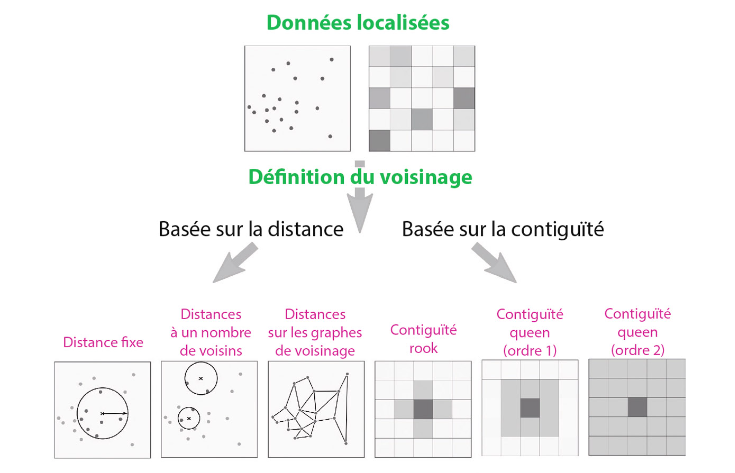
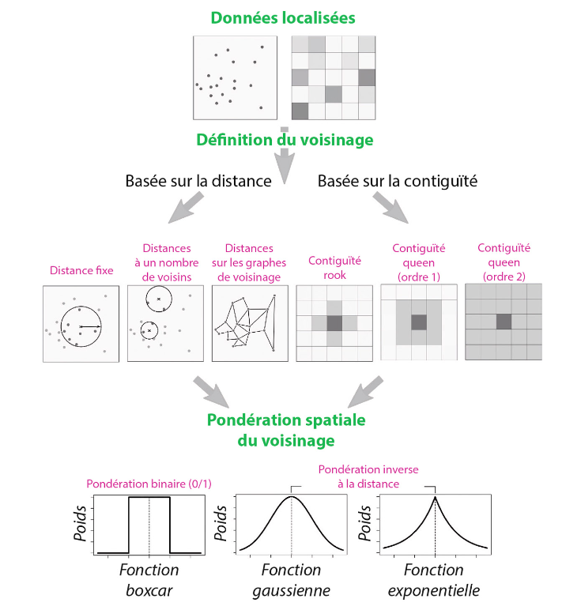
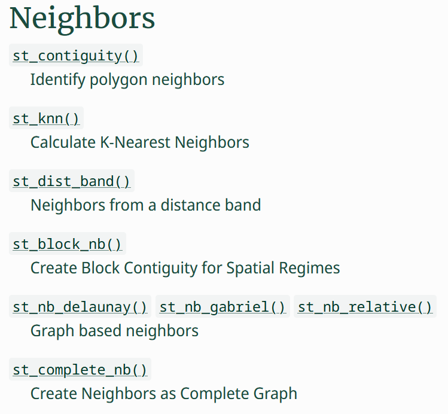
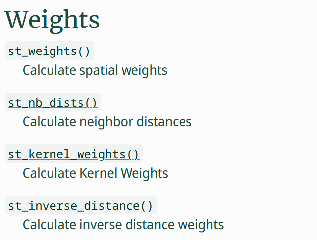
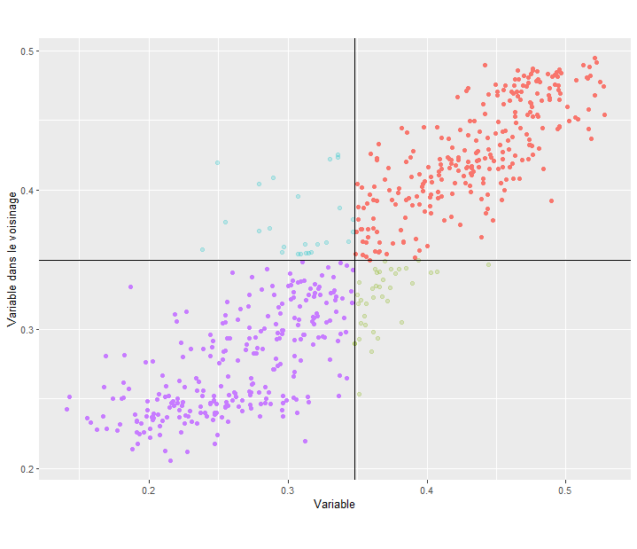

## Définition {.smaller}

<br/>  

> L’autocorrélation mesure la corrélation d’une variable avec elle-même, lorsque les observations sont considérées avec un décalage dans le temps (autocorrélation temporelle) ou dans l’espace (autocorrélation spatiale).  
> Si la présence d’une qualité dans une partie d’un territoire rend sa présence dans les zones voisines plus ou moins probable, il existe un effet de contiguïté dans la structure spatiale, le phénomène montre une autocorrélation spatiale.  
> Lorsque l’autocorrélation est positive, des régions voisines tendent à avoir des propriétés identiques ou des valeurs semblables : de telles configurations sont par exemple des régions homogènes, ou bien des gradients réguliers.  
> Lorsque l’autocorrélation est négative, des régions voisines ont des qualités différentes, ou bien les valeurs fortes et faibles alternent.  
> Les mesures de l’autocorrélation spatiale dépendent de l’échelle d’analyse et du niveau de résolution de la grille à travers laquelle une distribution est observée.  
[Oliveau S., Autocorrélation spatiale, Hypergeo, 2017](https://hypergeo.eu/autocorrelation-spatiale/)

-----------

## Mesure

L'autocorrélation spatiale peut être mesurée de manière **globale** ou de manière **locale**, et de nombreux indicateurs existent pour chacune de ces dimensions.

::: {.incremental}
- Autocorrélation spatiale globale
  * $I$ de Moran,
  * $C$ de Geary,
  * $G$ de Getis-Ord
  * ...

:::  

::: {.incremental}
- Autocorrélation spatiale locale : *Local Indicators of Spatial Association* "LISA"
   - $I$ local de Moran,
   - $C$ local de Geary,
   - $Gi$ local de Getis-Ord,
   - ...
:::

------------

## Fonctionnement

Tous ces indicateurs fonctionnent à partir de trois composantes tirées d'un jeu de données spatial (ponctuel ou polygonal) :

::: {.incremental}
- Une variable quantitative
- Une matrice de voisinage
- Une matrice de poids associés
:::

------------

## Voisinages

::: {.attribution}
FEUILLET, Thierry, COSSART, Etienne et COMMENGES, Hadrien, 2019. Manuel de géographie quantitative. Armand Colin.
:::

{fig-align="center"}


------------

## Voisinages et pondérations

::: {.attribution}
FEUILLET, Thierry, COSSART, Etienne et COMMENGES, Hadrien, 2019. Manuel de géographie quantitative. Armand Colin.
:::

{fig-align="center"}

------------

## Mesures globales et locales

- Les mesures d'autocorrélation locales correspondent à une qualification de l'autocorrélation dans le voisinage de chacune des entités spatiales
- Les mesures d'autocorrélation globales sont généralement une moyenne* de ces mesures d'autocorrélation locale pour l'ensemble des entités

-------------

## Mesures globales {.smaller}

### $I$ de Moran - Théorie

$$
I \in [-1,1]={\frac {N}{\sum _{i}\sum _{j}w_{ij}}} \times {\frac {\sum _{i}\sum _{j}w_{ij}(X_{i}-{\bar {X}})(X_{j}-{\bar {X}})}{\sum _{i}(X_{i}-{\bar {X}})^{2}}}
$$

avec :  

:::: {.columns}

::::: {.column .fragment}
* $N$ : nombre d'entités  
* $w_{ij}$ : Poids (*weight*) de la relation $ij$
* $X_i$ : valeur de la variable $X$ pour l'entité $i$
* $X_j$ : valeur de la variable $X$ pour l'entité $j$
* ${\bar X}$ : moyenne de la variable $X$
:::::

::::: {.column .fragment}
- d'où : ${\frac {N}{\sum _{i}\sum _{j}w_{ij}}}$ : neutralisation des poids
<br/>
- $(X_{i}-{\bar {X}})(X_{j}-{\bar {X}})$ : covariance $ij$
- ${\sum _{i}(X_{i}-{\bar {X}})^{2}}$ : variance de $X$
:::::

::::

::::: {.fragment}
L'indice $I$ de Moran mesure donc le rapport normalisé entre une covariance pondérée et une variance, soit à peu de chose près, une corrélation linéaire entre les valeurs de X en $i$ et $j$ :  

* Pour $I$ proche de 1 : autocorrélation spatiale **positive**
* Pour $I$ proche de -1 : autocorrélation spatiale **négative**
* Pour $I$ proche de 0 : pas d'autocorrélation spatiale

:::::

-------------

## Mesures globales {.smaller}

### $C$ de Geary - Théorie

::: {.attribution}
FEUILLET, Thierry, COSSART, Etienne et COMMENGES, Hadrien, 2019. Manuel de géographie quantitative. Armand Colin.
:::

$$
C \in [0,2] = {\frac{N-1}{2\sum_i\sum_jw_{ij}}} \times \frac{\sum_i\sum_jw_{ij}(X_i-X_j)^2}{\sum_i(X_i - \bar{X})^2}
$$

:::: {.fragment}

* Un indice similaire au $I$ de Moran, mais qui ne mesure plus la covariance mais l'écart au carré entre $X_i$ et $X_j$, et est pondéré différement :

* Pour $C$ proche de 0 : autocorrélation spatiale **positive**
* Pour $C$ proche de 1 : pas d'autocorrélation spatiale
* Pour $C$ proche de 2 : autocorrélation spatiale **négative**


::::

-------------

## Mesures globales en pratique

* Définition d'une matrice de voisinages
* Définition d'une matrice de poids associés
* Calcul de l'indicateur

----------

### Matrices de voisinage avec R

Via le package `sfdep` (conversion pour des objets `sf` du package `spdep` qui s'appuit sur des objets `sp`), de nombreuses fonctions à disposition :

:::: columns

::::: column
{fig-align="center"}
:::::

::::: column
{fig-align="center"}

:::::

::::

::: {.attribution}
[https://sfdep.josiahparry.com/reference/#neighbors](https://sfdep.josiahparry.com/reference/#neighbors)
:::

----------

### Matrices de voisinage avec R

```{r}
#| echo: true
#| eval: true
#| warnings: false

library(tidyverse)
library(sf)
library(sfdep)

bars <- st_read("../DATA/MGB_Paris_L93.gpkg", as_tibble = TRUE, quiet = TRUE) %>%
  filter(!is.na(regularPrice))
geom_bars <- st_geometry(bars)
```


::::: {.columns}

:::: {.column width="28%" style='font-size:75%;' .fragment}

#### Rayon fixe

```{r}
#| echo: true
#| eval: true
voisinage_bande <- st_dist_band(bars, lower = 0, upper = 500)
voisinage_bande
```

::::

:::: {.column width="28%" style='font-size:75%;' .fragment}

#### N-voisins

```{r}
#| echo: true
#| eval: true
voisinage_knn <- st_knn(bars, k = 5)
voisinage_knn
```

::::

:::: {.column width="28%" style='font-size:75%;' .fragment}

#### Distance graphe (Delaunay ici)

```{r}
#| echo: true
#| eval: true
voisinage_graphe <- st_nb_delaunay(st_geometry(bars))
voisinage_graphe
```

::::

:::: {.column width="28%" style='font-size:75%;' .fragment}

#### Structure de l'objet

```{r}
#| echo: true
#| eval: true
str(voisinage_bande, list.len = 7)
```

::::

:::::

----------

### Matrices de poids avec R

Toujours via `sfdep` :

:::: columns

::::: column
{fig-align="center"}
:::::

::::: column
{fig-align="center"}

:::::

::::

::: {.attribution}
[https://sfdep.josiahparry.com/reference/#weights](https://sfdep.josiahparry.com/reference/#weights)
:::

----------


### Matrices de poids avec R

::::: {.columns}

:::: {.column width="28%" style='font-size:75%;' .fragment}

#### Poids égaux normalisés

```{r}
#| echo: true
#| eval: true
poids_egaux <- st_weights(voisinage_knn)
str(poids_egaux, list.len = 5)
```

::::

:::: {.column width="28%" style='font-size:75%;' .fragment}

#### Poids distance

```{r}
#| echo: true
#| eval: true
poids_distance <- st_nb_dists(x = bars, nb = voisinage_knn)
str(poids_distance, list.len = 5)
```

::::

:::: {.column width="28%" style='font-size:75%;' .fragment}

#### Poids inverse distance

```{r}
#| echo: true
#| eval: true
poids_IDW <- st_inverse_distance(
  geometry = bars, nb = voisinage_knn
)
str(poids_IDW, list.len = 5)
```

::::

:::: {.column width="28%" style='font-size:75%;' .fragment}

#### Poids fonction distance

```{r}
#| echo: true
#| eval: true
poids_kernel <- st_kernel_weights(
  geometry = bars, nb = voisinage_knn, kernel="quartic"
)
str(poids_kernel, list.len = 5)
```

::::

:::::

----------

### Calcul des indices d'autocorrélation spatiale globale

:::: columns

::::: column

#### $I$ de Moran
```{r}
#| echo: true
#| eval: true
indice_i_moran <- global_moran(
  x = bars$regularPrice,
  nb = voisinage_knn,
  wt = poids_kernel
  )
indice_i_moran
```
:::::

::::: column

#### $C$ de Geary
```{r}
#| echo: true
#| eval: true
indice_c_geary <- global_c(
  x = bars$regularPrice,
  nb = voisinage_knn,
  wt = poids_kernel
  )
indice_c_geary
```

:::::


::::

----------

### Calcul des indices d'autocorrélation spatiale globale

:::: columns

::::: column

#### $I$ de Moran
```{r}
#| echo: true
#| eval: true

knn20 <- st_knn(bars, k = 20)
indice_i_moran <- global_moran(
  x = bars$regularPrice,
  nb = knn20,
  wt = st_kernel_weights(geometry = bars,
    nb = knn20, kernel="quartic")
  )
indice_i_moran
```

:::::

::::: column

#### $C$ de Geary
```{r}
#| echo: true
#| eval: true
knn20 <- st_knn(bars, k = 20)
indice_c_geary <- global_c(
  x = bars$regularPrice,
  nb = knn20,
  wt = st_kernel_weights(geometry = bars,
    nb = knn20, kernel="quartic")
  )
indice_c_geary
```

:::::


::::


-----------------

## Mesures locales


> Si les indicateurs globaux (I de Moran et C de Geary) permettent de savoir s’il existe des regroupements de valeurs similaires/dissimilaires, les indicateurs locaux permettent de savoir où ces regroupements se localisent.  
> Ils constituent donc un moyen de localiser des contextes spatiaux homogènes (ou au contraire très hétérogènes). L’autre intérêt de leur utilisation est de pouvoir révéler l’existence de regroupements locaux homogènes en dépit d’une analyse globale ayant conclu à l’absence d’autocorrélation, en raison de l’effet de lissage des analyses globales en général.  
> Ces indicateurs locaux d’autocorrélation sont désignés sous le nom de « LISA », pour Local Indicators of Spatial Association [ANSELIN, 1995].
> Leur principe est simple : décliner la mesure de l’autocorrélation spatiale pour chaque observation en fonction du voisinage local.  

[FEUILLET, Thierry, COSSART, Etienne et COMMENGES, Hadrien, 2019. Manuel de géographie quantitative. Armand Colin]{style="font-size:65%"}

-----------------

## $I$ de Moran local - Théorie

$$
I_i = \frac{(X_i-\bar{X})}{{\sum_{k}^{N}(X_k-\bar{X})^2}/(N-1)}\times{\sum_j w_{ij}(X_j-\bar{X})}
$$
Si les poids sont standardisés (réduits), cela donne

$$
I_i = (X_i-\bar{X})\times{\sum_{j}w_{ij}(X_j-\bar{X})}
$$

C'est la somme pondérée de cet indicateur local qui donne le $I$ de Moran global, et ce $I$ local donne donc une valeur unifiée de l'autocorrélation locale de chaque point.

-----------------

## $I$ de Moran local - Théorie

En pratique, on cherche le plus souvent à identifier des *clusters* d'entités spatiale fortement auto-corrélées pour identifier des zones d'interêt.

Pour cela, on mène une étude de "quadrant" sur les valeurs locales et sur les valeurs (pondérées) de leurs voisinages, en les découpant par la moyenne/médiane/... de ces variables.

{fig-align="center"}

-----------------

## $I$ de Moran local - Théorie

:::: columns

::::: column
{fig-align="center"}
:::::

::::: column
* On cherche notamment à observer les clusters "High-High" : valeurs fortes dans un contexte de valeurs fortes
  * régions performantes, poches de richesse, zones touristiques etc.
* Et les valeurs "Low-Low" : valeurs faibles dans un contexte de valeurs faibles
  * ghettos / poches de pauvreté, zones ségréguées etc.

:::::

::::

-----------------

## $I$ de Moran local - Calcul avec R

* Création d'une matrice de voisinage
* Création d'une liste de pondérations
* Analyse du quadrant
* Cartographie des clusters

-----------------

## $I$ de Moran local - Calcul avec R {.incremental}

::: {.fragment}

* Création d'une matrice de voisinage : on reprend la matrice des 20 plus proches bars précédemment créée

:::

::: {.fragment}

```{r}
#| echo: true
matrice_voisinage_bars <- st_knn(bars, k = 20)
```

:::

::: {.fragment}
* Création d'une liste de pondérations : on reprend une pondération par fonction quadratique

:::

::: {.fragment}

```{r}
#| echo: true
matrice_poids_bars <- st_kernel_weights(geometry = bars, nb = knn20, kernel="quartic")
```

:::

::: {.fragment}

* Analyse du quadrant

:::

::: {.fragment}

```{r}
#| echo: true
#| eval: false
bars$prix_voisinage <- st_lag(
  x = bars$regularPrice,
  nb = matrice_voisinage_bars,
  wt = matrice_poids_bars
)
moyenne_prix <- mean(bars$regularPrice)
moyenne_prix_voisinage <- mean(bars$prix_voisinage)
ggplot(bars) +
  geom_point(aes(regularPrice, prix_voisinage)) +
  geom_hline(yintercept = moyenne_prix_voisinage) +
  geom_vline(xintercept = moyenne_prix)
```

:::

-------------------

```{r}
#| echo: false
#| eval: true
bars$prix_voisinage <- st_lag(
  x = bars$regularPrice,
  nb = matrice_voisinage_bars,
  wt = matrice_poids_bars
)
moyenne_prix <- mean(bars$regularPrice)
moyenne_prix_voisinage <- mean(bars$prix_voisinage)
ggplot(bars) +
  geom_point(aes(regularPrice, prix_voisinage)) +
  geom_hline(yintercept = moyenne_prix_voisinage) +
  geom_vline(xintercept = moyenne_prix)
```

#### Problème de pondération non corrigée, il faut le faire manuellement

--------------------------------------

```{r}
#| echo: true
#| eval: false
#| code-line-numbers: "1,7"

poids_totaux <- matrice_poids_bars %>% map(~sum(.x)) %>% unlist()
bars$prix_voisinage <- st_lag(
  x = bars$regularPrice,
  nb = matrice_voisinage_bars,
  wt = matrice_poids_bars
)
bars$prix_voisinage <- bars$prix_voisinage / poids_totaux
moyenne_prix <- mean(bars$regularPrice)
moyenne_prix_voisinage <- mean(bars$prix_voisinage)
ggplot(bars) +
  geom_point(aes(regularPrice, prix_voisinage)) +
  geom_hline(yintercept = moyenne_prix_voisinage) +
  geom_vline(xintercept = moyenne_prix)
```

--------------------------------------

```{r}
#| echo: false
#| eval: true
#| code-line-numbers: "1,7"

poids_totaux <- matrice_poids_bars %>% map(~sum(.x)) %>% unlist()
bars$prix_voisinage <- st_lag(
  x = bars$regularPrice,
  nb = matrice_voisinage_bars,
  wt = matrice_poids_bars
)
bars$prix_voisinage <- bars$prix_voisinage / poids_totaux
moyenne_prix <- mean(bars$regularPrice)
moyenne_prix_voisinage <- mean(bars$prix_voisinage)
ggplot(bars) +
  geom_point(aes(regularPrice, prix_voisinage)) +
  geom_hline(yintercept = moyenne_prix_voisinage) +
  geom_vline(xintercept = moyenne_prix)
```

--------------------------------------

* Calcul de l'indicateur local de Moran pour en extraire les clusters

```{r}
#| echo: true
bars_local_moran <- local_moran(
  x = bars$regularPrice,
  nb = matrice_voisinage_bars,
  wt = matrice_poids_bars
  ) %>%
  as_tibble()
print(bars_local_moran, n = 5)
```


```{r}
#| echo: true
bars_local_moran %>% select(9:12) %>% print(n = 5)
```

--------------------------------------

* Cartographie des bars en fonction de leur quadrant vis-à-vis de la médiane

```{r}
#| echo: true
bars$quadrant <- bars_local_moran$median
bars$Ilocal <- bars_local_moran$ii
bars$pvalue <- bars_local_moran$p_ii
ggplot(bars) +
  geom_sf(aes(colour = quadrant, size = abs(Ilocal), alpha = log10(1/pvalue))) +
  theme_void()
```


-----------------------------

::: callout-warning

#### Exercice - Autocorrélation et résultats électoraux

- Menez une étude de l'autocorrélation spatiale d'un candidat au choix : choix du voisinage, choix de la pondération, indicateur global, indicateur local et cartographie

:::

